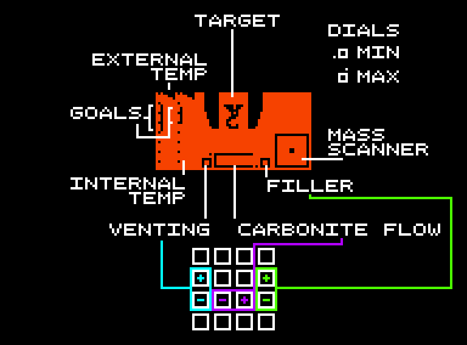

# Carbon8
Carbon8 is a chip8 game and a submission for Octo-ber jam V: http://www.awfuljams.com/octojam-v/games/carbon8 (playable at this link)
It's written for Octo, a high-level assembler for Chip 8, an 8 bit assembly language from the 1970s: https://github.com/JohnEarnest/Octo

This is a tie in game for a popular 1980s science fiction movie, made in the purest and most authentic cosmac era chip 8, and built to run at a realistic speed. It's supposed to take a large amount of inspiration from cooking reality TV shows but I believe that currently a lot of that has been sadly lost to time constraints. Lots of free memory though!!

## Controls

Q / A controls the Vent dial. Allows warm outside air in to warm up the target

S / D controls the Carbonite flow. This will cool the target down

R / F controls the Filler gas flow. This will allow you to fill the mass needed faster without cooling the target down.

The Slab will form as Carbonite and Filler flow into the chamber over time. The freezing process is only complete once the entire slab is formed. It is at this time that judgement will be rendered.

Your goal is to try and match both of the target internal and external temperature goals for the subject being frozen, but this only matters in the same instant that the slab is completed.

This will achieve the best result and help you move forward to the next round. You will need to master the multiple aspects of the Carbonite Chamber in order to achieve all of your goals.