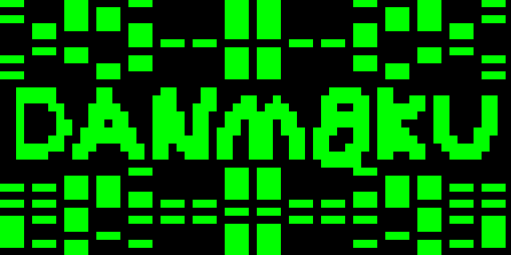
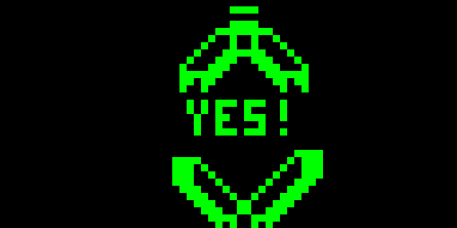

Danm8ku postmortem / devlog
===========================
I started off writing danm8ku as a bullet hell engine for chip-8 danm8ku games, and i built it upon this pretty simplistic game which shows off some of the features. I tried to keep the difficulty reasonable, but looking at the octojam twitch stream, I guess people without much bullet hell game experience just can't play these games very well anyways, so I might as well have made some patterns a bit harder.

Writing this up with quite a lot of detail, but someone might find some stuff in here interesting.

First off, here's what the game looks like when played through:

Title screen
------------
The title screen is actually pretty neat. Here is everything but the title screen removed, running at a slower pace to show off how it works: http://johnearnest.github.io/Octo/index.html?gist=de467a09480be597df33

It first draws the text, and then increments a 8 bit binary counter for a random line. Basically, algorithm is (for one side of the screen):

1. Get a random line
2. Set the X position to 0
3. Draw a sprite at position X
4. If I drew over an existing sprite, increment X by 4 and go to step 3
5. Repeat

Removing the text drawing part makes it even easier to follow (less than 50 bytes): http://johnearnest.github.io/Octo/index.html?gist=586e37d76decd37fc78f

Bullet engine
-------------
Most of the effort is put into the bullet engine, which is actually rather complex, since it requires allocating and moving up to 32 bullets on screen at the same time, which gets awkward even when running the game at 1000 cycles (Octo games generally have very few moving sprites).

Each bullet takes up 8 bytes of space, containing:

- x position (two bytes)
- y position (two bytes)
- x velocity (one byte)
- y velocity (one byte)
- x acceleration (one byte)
- sprite offset (one byte)

In practice, very few bits of x acceleration are actually needed, and it should be possible to merge it with sprite offset, although it would require a bit more computations, and the engine is already running very close to the cpu limit, so this seemed fine.

The bullets are stored in a 256byte dedicated area (memory address 3000), and should essentially be considered an array. Un-allocated bullets will have the x velocity set to 255, which is a magic value saying that its address is free for allocation. This should probably live in sprite offset instead, but whatever.

Whenever a tick in the engine occurs, move_bullet will be done on each active bullet. This updates bullets positions, and sets a sprite offset based on the current direction. This method is heavily optimized in some non-obvious ways. One interesting difference is that x and y velocities are signed values, but they are not using ones compliment.

Position is then updated based on velocity using the following logic

    vc := vx       # store velocity in a temp variable for later
    vx <<= vx      # multiply by two, check for neg bit             
    va := vf       # va will be 1 here if the velocity is negative
    x_f += vx      # add the velocity to the one byte fractional counter of x,
                   # if this overflows, we should move the bullet one step
    vx := vc       # restore velocity
    # Hack to avoid jumps/comparisons to do:
    # if vf != 0 begin
    #   if va == 0 then x += 1
    #   if va == 1 then x -= 1
    # end
    va &= vf
    v8 := vf
    v8 -= va
    v8 -= va
    x += v8

I tried doing something like this with "regular" signed arithmetic, but couldn't get it this fast. One nice thing here, is that v8 will be set to 1 if x velocity is positive, -1 if negative, and 0 if not moving. This means that we can do this for both X and Y, and then use these values to setup the sprite_offset byte to a unique value for all 9 possible movements:

    # Set sprite_offset to values used to get movement sprites.
    # v8 is X direction
    # vd is Y direcation
    so := v8 
    if v8 > 1 then
      so := 2
    if vd > 1 then
      vd := 2
    vd <<= vd
    vd <<= vd
    so |= vd

Then when drawing the bullet, I do:

    i := bul_nop
    so <<= so   # multiply by four, since each sprite is four bytes
    so <<= so 
    i += so
    sprite x y 4

This then fetches the next sprite data to XOR to the bullet, to make it look like its moving in that direction, without having to call clear. Data is:

    # Sprite movement data
    # ORDER OF THESE ARE IMPORTANT. DON'T REORDER.
    : bul_nop 0x00 0x00 0x00 0x00   # 0
    : bul_r 0x00 0xA0 0xA0 0x00     # 1
    : bul_l 0x00 0x50 0x50 0x00     # 2
    : bul   0x00 0x60 0x60 0x00     # 3 (not used for movement?)
    : bul_d 0x60 0x00 0x60 0x00     # 4
    : bul_dr 0xC0 0xA0 0x60 0x00    # 5
    : bul_dl 0x30 0x50 0x60 0x00    # 6
    : bullet_count 0                # 7 (unused so storing other stuff here)
    : player_position 5 15
    : UNUSED1 0
    : bul_u 0x00 0x60 0x00 0x60     # 8
    : bul_ur 0x00 0x60 0xA0 0xC0    # 9
    : bul_ul 0x00 0x60 0x50 0x30    # 10

Note that the sprite_offset can't map to values 3 or 7, so it's possible to store some other data there, as long as it's four bytes to keep the offsets correct. Here, I actually store the initial bullet sprite "bul" + some unrelated variables, just to save ROM storage.

Clear data works the same (see clr_nop and onwards). Most other stuff with the handling is pretty straight forward.

Spawning a bullet is done by doing something like:

    gogo_bullet x := 35 y := vc vx := 66 vy := 12 ax := 2 pew_pew

Subsequent bullets that should use similar attributes, with just a few changes, can just modify whats needed, like:

    gogo_bullet x := 50 y := vc vx := 230 vy := 0 pew_pew
    gogo_bullet x := 54 pew_pew  # everything but X start position is the same as the first
    gogo_bullet x := 58 pew_pew  # everything but X start position is the same as the first

Technically, the lines above will only work assuming that the currently active pattern wont reach the max limit of bullets. If the pattern should spawn lots of bullets (like pattern 2), the pattern will need to check that v8 is non-zero, after calling gogo_bullet, example:

    gogo_bullet   # will set v8 to 1 if a bullet can be spawned
    if v8 == 1 begin
        vx := random 127
        vx += 127
        x := 57 y := vc  vy := 35 ax := 0 pew_pew
    end

Pattern engine
--------------
Since the bullet engine has this nice interface described above for spawning bullets, the pattern engine can be pretty simple. Each pattern is just a memoryblock, ending with a jump to "pattern_done", these patterns are then store after eachother and accessed through a jump0 call.

    : pattern1  # example pattern
        v0 := 0b00000111
        v0 &= vd
        if v0 == 0b00000111 begin
            vc := random 31
            gogo_bullet
            ax := 2
            vx := random 63
            vx += 170
            x := 55 y := vc pew_pew
        end
        jump pattern_done
    : pattern
        jump pattern1
        jump pattern2
        jump pattern3
        jump pattern4
        jump pattern5
        jump pattern6
        jump pattern7
        jump pattern8
        jump youwin

The main game loop keep track of the number of ticks, and when a counter is reached, will increment the pattern_state by 2, and each tick, the following logic will make sure that the pattern is executed:

    i := pattern_state
    load v0
    jump0 patterns

Each pattern then has a register "vd" set to the number of ticks that has triggered inside the pattern, making it possible to make certain bullets spawn at certain times, allowing for complex things!

Ending screen
-------------
The ending screen is also pretty neat, although less minimalistic (and not really optimized) compared to the startup screen:

http://johnearnest.github.io/Octo/index.html?gist=d315690f033bde3188e4

Drawing it slowly should make it pretty visible that the algorithm for this is extremely simple:

http://johnearnest.github.io/Octo/index.html?gist=20c8e5265cedf41265cc

The data being drawn is the first 4 lines of the Zero in the built in Octo font.

Retrospective
-------------
Looking at the jonterp twitch stream of this game, where they were unable to get past the second level, I guess this game isn't really for everyone, but I only really wrote it for myself, and I'm pretty pleased with it.

Some patterns are not very thought through, since I found the main engine the most exciting part, so I might come back to the engine later, and produce something new. We'll see.
