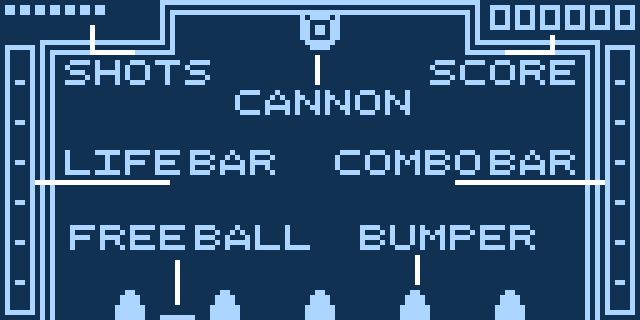

# OCTOPEG
Octopeg is a submission for Octo-ber jam II: http://octojam.com/octojam-ii/games/octopeg
It's written for Octo, a high-level assembler for Chip 8, an 8 bit assembly language from the 1970s: https://github.com/JohnEarnest/Octo

## Game Readme
OCTOPEG is a game about the destruction of pegs.

Use WSAD to aim the cannon. Press E to fire.

You start each level with a number of shots. You can see these in the top left corner. You will get fewer shots as the game progresses.

When you run out of shots, you will progress to the next level. There are 8 levels. It is not possible to lose.

Your turn ends when your ball falls into a chute. You can also press Q if your ball actually for real gets stuck forever.

If your ball falls into the chute with the moving indicator in it, you will get a FREE BALL, which allows you take an extra shot.

Hitting pegs will fill the bars on the left and right of the screen. The bar on the left is the LIFE BAR. The bar on the right is the COMBO BAR. The COMBO BAR resets every level, the LIFE BAR does not.

Fill the LIFE BAR on the left of the screen to get an extra shot.

Fill the COMBO BAR on the right of the screen to enter FEVER mode. Your COMBO BAR will fill quicker if you achieve a high STREAK. A STREAK is how many pegs you hit in a single turn.

The higher your COMBO BAR is, the more points each peg is worth.

When in FEVER mode, you will get some extra BONUS POINTS depending on which chute you fall into. The chutes in the middle are worth the most. Your COMBO BAR will become empty afterwards. Make it count!