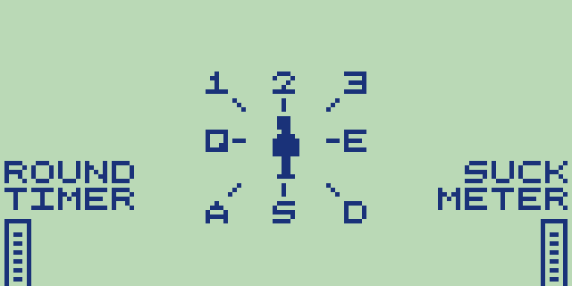

# Sens8tion
Sens8tion is a superchip game and a submission for Octo-ber jam III: http://www.awfuljams.com/octojam-iii/games/sens8tion (playable at this link)
It's written for Octo, a high-level assembler for Chip 8, an 8 bit assembly language from the 1970s: https://github.com/JohnEarnest/Octo

This is a video game implimentation of the popular? action schlock movie Equilibrium.

## Controls

Generally you'll need to use W to progress in cutscenes.

The other Input buttons are:  
1 2 3  
Q W E  
A S D

Basic Goal or Something
You play a Tetragrammaton Cleric, doing what you do best and ignoring most of the other parts of the movie.

Your goal in this game is to shoot all the people standing around you before the round time elapses (bottom left bar). You will shoot an antagonist that is present in the 'zone' in the direction of your keypress, with W being the centre point, 2 being 'above you', and around you in a clockwise fashion. You can press W to stand idle, which you might like to do at the end of a level if there's no one to shoot.

The game is very stylised so expect the unexpected. Any remaining antagonists will probably add a point to the bar on the right side, referred to as the 'suck' bar. When the suck bar is filled, you probably suck.

If you don't get the reference, this is a game that is based quite heavily on the movie "Equilibrium". I got the idea for the game while thinking of games that would make use of Chip8's strange input layout, and get a bit of a kick to the rather heavy handed cohesion to the movie's events, even when they significantly ate into my memory budget.

## Some Other Stuff
I really ran out of time and rom space on this project, but I didn't really end up cutting too much that I really wanted in there. I wanted to format the text better, wanted more of it to dance, and more graphics in the cutscenes. I was really glad to keep the katana men and have a semblance of what I wanted for the final boss.

I didn't manage to get the rom under the SCHIP memory limit before the end of the jam, but I did by about 40 minutes later, here. Apparently I also left an active breakpoint in, too. This is the original submission link: http://johnearnest.github.io/Octo/index.html?gist=9ee01a6ec5e4de2bb19dd2553e5bb8ce

Ultimately I've traded the awfuljams link out for the smaller schip compatible binary here: http://johnearnest.github.io/Octo/index.html?gist=f23509930767ff96c3101247ae172d17 mainly because of the breakpoint and secondly because the solution was so minor (just moving a the undrawing of some sprites to a slightly different position in a loop)

